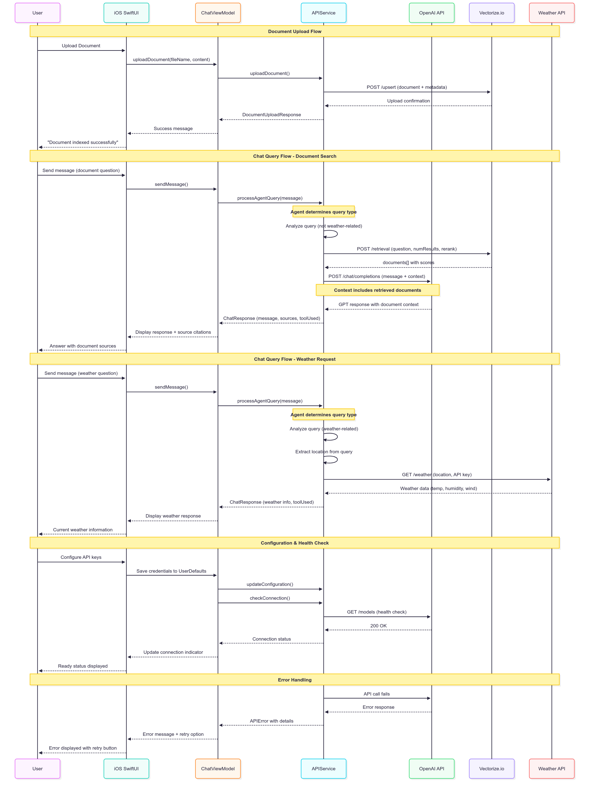
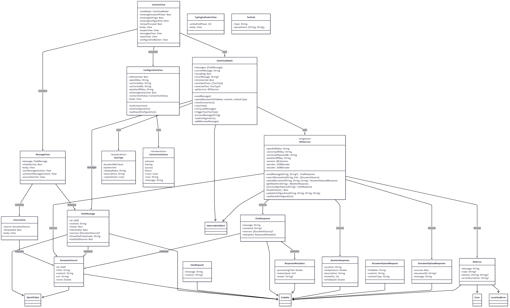

# RAG Agent iOS App

A production-ready Retrieval-Augmented Generation (RAG) agent built with iOS Swift and SwiftUI, featuring real-time document retrieval using Vectorize.io and weather information tools. 

## ✨ Features

### 🤖 **Intelligent AI Tools**
1. **📄 Document Search**: Upload and search through documents using RAG with Vectorize.io
2. **🌤️ Weather Information**: Get real-time weather data for any location worldwide
3. **🧠 Smart Routing**: Automatically determines which tool to use based on your query

### 📱 **Modern iOS Experience**
- **SwiftUI Interface**: Native iOS design with smooth animations
- **Real-time Chat**: Instant responses with typing indicators
- **Document Upload**: Simple drag-and-drop or text input for documents
- **Source Citations**: View and expand document sources with relevance scores
- **Connection Monitoring**: Live API status indicators
- **Tool Visualization**: See which AI tool is actively being used
- **Secure Configuration**: Built-in API key management

### ☁️ **Production APIs**
- **OpenAI GPT-4o-mini**: Advanced language model for chat completions
- **Vectorize.io**: Enterprise-grade vector database for document embeddings
- **OpenWeatherMap**: Real-time weather data for global locations
- **Health Monitoring**: Automatic connection testing and status updates

## 🚀 Quick Start

### Prerequisites
Get your API credentials ready:
1. **OpenAI API Key** - [Get yours here](https://platform.openai.com/api-keys)
2. **Vectorize.io Account** - [Sign up at Vectorize.io](https://vectorize.io)
3. **Weather API Key** (Optional) - [OpenWeatherMap free tier](https://openweathermap.org/api)

### Installation & Setup

1. **Clone and Build**
   ```bash
   git clone <your-repo-url>
   cd doc-retrival-agent
   open doc-retrival-agent.xcodeproj
   ```

2. **Configure APIs**
   - Launch the app and tap **"Configure"**
   - Enter your API credentials:
     - **OpenAI API Key** (starts with `sk-`)
     - **Vectorize API Key** 
     - **Vectorize Pipeline URL** (from your Vectorize.io dashboard)
     - **Weather API Key** (optional but recommended)
   - Tap **"Test Connection"** to verify
   - Tap **"Save"** to complete setup

3. **Start Chatting**
   - Upload your first document using the **+** button
   - Ask questions about your documents
   - Try weather queries: *"What's the weather in Tokyo?"*
   - Watch the AI automatically choose the right tool!

## 🏗️ Architecture

### System Design
```
iOS SwiftUI App
├── OpenAI GPT-4o-mini ──→ Intelligent Responses
├── Vectorize.io API ────→ Document Search & RAG
└── OpenWeatherMap ──────→ Real-time Weather Data
```

### Sequence Diagram


The sequence diagram above illustrates the complete flow of interactions between components:
- **Document Upload Flow**: User uploads → Vectorize.io indexing → confirmation
- **Document Search Flow**: Query → agent routing → Vectorize retrieval → OpenAI context enrichment → response with sources
- **Weather Flow**: Query → agent detection → direct weather API call → formatted response
- **Configuration Flow**: API setup → health checks → connection status updates

### Class Diagram


The class diagram shows the complete system architecture:
- **UI Layer**: SwiftUI views (ContentView, MessageView, ConfigurationView)
- **Business Logic**: ChatViewModel and APIService with clear separation of concerns
- **Data Models**: Comprehensive model structure with protocol conformance
- **API Integration**: Clean abstraction for external services

### RAG Pipeline
1. **Document Upload** → Vectorize.io processes and indexes content
2. **User Query** → System analyzes intent (document vs weather vs general)
3. **Tool Selection** → Automatically routes to appropriate API
4. **Context Retrieval** → Fetches relevant documents (if needed)
5. **AI Response** → GPT-4o-mini generates answer with sources

## 📋 Usage Examples

### 📄 Document Queries
```
"What does the documentation say about installation?"
"Summarize the key features from my uploaded files"
"Find pricing information in the documents"
"What are the system requirements?"
```

### 🌤️ Weather Queries  
```
"What's the weather in New York?"
"Is it raining in London right now?"
"Temperature in San Francisco"
"Weather forecast for Tokyo"
```

### 🤖 Smart Agent Behavior
- **Automatic Tool Detection**: No need to specify which tool to use
- **Context Awareness**: Remembers conversation history
- **Source Attribution**: Always shows where information came from
- **Error Handling**: Graceful fallbacks and helpful error messages

## 🛠️ Technical Implementation

### Core Components
```
doc-retrival-agent/
├── 📄 Models.swift              # Data structures and types
├── 🌐 APIService.swift          # API integrations (OpenAI, Vectorize, Weather)
├── 🧠 ChatViewModel.swift       # Business logic and state management
├── 📱 ContentView.swift         # Main chat interface
├── 💬 MessageView.swift         # Message display with source citations
├── ⚙️ ConfigurationView.swift   # API credential management
└── 🎨 Assets.xcassets/         # App icons and visual assets
```

### API Integration Details

**OpenAI Chat Completions**
```swift
// Intelligent context building with retrieved documents
let messages = [
    ["role": "system", "content": "Context: [Retrieved Documents]"],
    ["role": "user", "content": userQuery]
]
```

**Vectorize.io Document Search**
```swift
// Semantic search with reranking
let requestBody = [
    "question": query,
    "numResults": 5,
    "rerank": true
]
```

**Weather API Integration**
```swift
// Real-time weather data
let url = "https://api.openweathermap.org/data/2.5/weather?q=\(location)&appid=\(apiKey)"
```

## 🔧 Configuration

### Required Settings
- **OpenAI API Key**: For chat completions and intelligent responses
- **Vectorize API Key**: For document processing and search
- **Vectorize Pipeline URL**: Your specific pipeline endpoint

### Optional Settings
- **Weather API Key**: Enables real-time weather information

### Security Features
- **Local Storage**: API keys stored securely on device
- **Input Validation**: Automatic trimming and validation
- **Connection Testing**: Built-in API verification
- **Error Recovery**: Automatic retry mechanisms

## 📊 Performance

### Optimized for Production
- **Real-time Responses**: Sub-second API calls
- **Efficient Caching**: Smart request optimization
- **Error Handling**: Comprehensive error management
- **Resource Management**: Optimized memory usage

### Scalability Features
- **Async Operations**: Non-blocking API calls
- **State Management**: Efficient SwiftUI state handling
- **Connection Pooling**: Optimized network requests

## 🔍 Troubleshooting

### Common Issues

**Configuration Problems**
- ✅ Ensure no trailing spaces in API keys
- ✅ Verify Vectorize pipeline URL format
- ✅ Check connection test shows green status

**API Errors**
- **OpenAI 401**: Invalid API key
- **OpenAI 429**: Rate limit exceeded (wait and retry)
- **Vectorize 400**: Check pipeline configuration
- **Weather 401**: Invalid or inactive weather API key

**Performance Issues**
- Clear app data and reconfigure
- Check internet connection stability
- Verify API service status

## 🎯 Best Practices

### For Users
1. **Document Upload**: Use clear, well-formatted documents
2. **Query Formulation**: Be specific in your questions
3. **Source Review**: Always check cited sources
4. **API Management**: Monitor usage and limits

### For Developers
1. **Security**: Never commit API keys to version control
2. **Error Handling**: Implement comprehensive error management
3. **Testing**: Use connection testing features
4. **Updates**: Keep API integrations current

## 📈 Next Steps

### Immediate Actions
1. **Upload Documents**: Add your content for RAG functionality
2. **Test Tools**: Try both document and weather queries
3. **Explore Features**: Check source citations and tool indicators
4. **Monitor Performance**: Watch connection status and response times

### Advanced Usage
- **Batch Document Upload**: Process multiple files
- **Query Optimization**: Learn effective prompt patterns
- **Source Management**: Organize and update document collections
- **Performance Monitoring**: Track API usage and costs

## 📋 Requirements

- **iOS**: 17.0 or later
- **Xcode**: 16.0 or later  
- **Swift**: 5.9 or later
- **macOS**: 14.0 or later (for development)
- **Network**: Internet connection for API calls
- **Storage**: Minimal local storage for configuration and document caching

## 🤝 Contributing

Based on the reference implementation: [agent-next-typescript](https://github.com/trancethehuman/agent-next-typescript)

### Architecture Alignment
- ✅ Multi-step agent pattern
- ✅ RAG implementation
- ✅ Tool-based AI system
- ✅ Real API integrations

---

**🎉 Ready to Start?** Configure your APIs and begin chatting with your intelligent RAG agent! The future of document interaction is here. 🤖📱✨ 